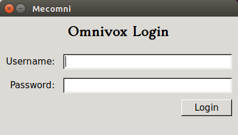
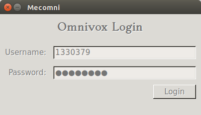
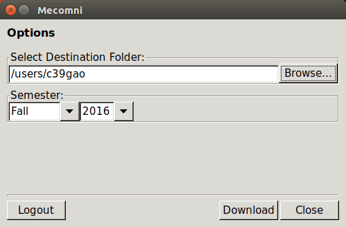
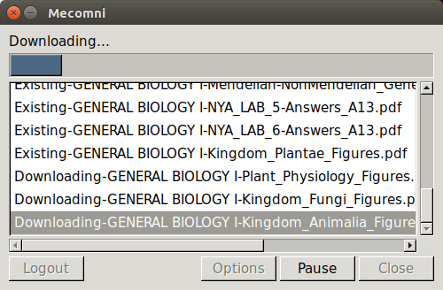
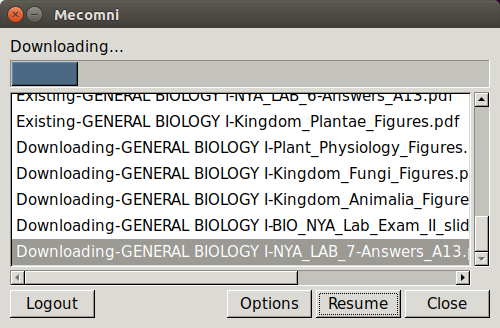
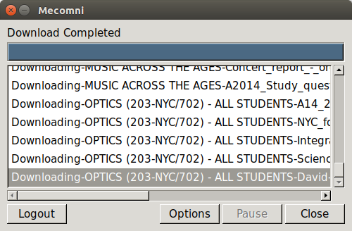
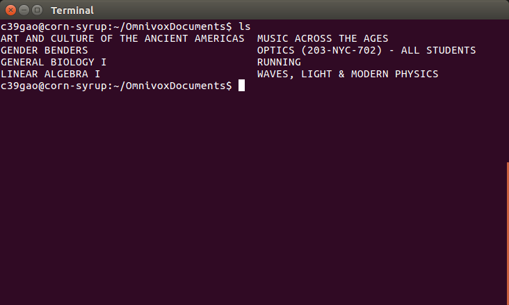
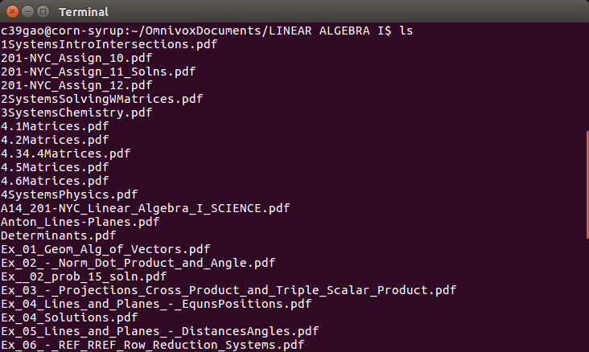

# Omnivox Extractor

Omnivox Extractor logins to Omnivox Account, downloads available documents, and classify in folder with a nice GUI.

### Installation
Omnivox requires wxPython to run:

Installation guide: https://wiki.wxpython.org/How%20to%20install%20wxPython

Others required packages are in requirement.txt
```sh
$ pip install -r requirements.txt
```

### Snapshots
















### Development
Test it out by running the following command
```sh
$ python controller.py
```
Contact the administator if one wants a username and a password to get the taste of it
